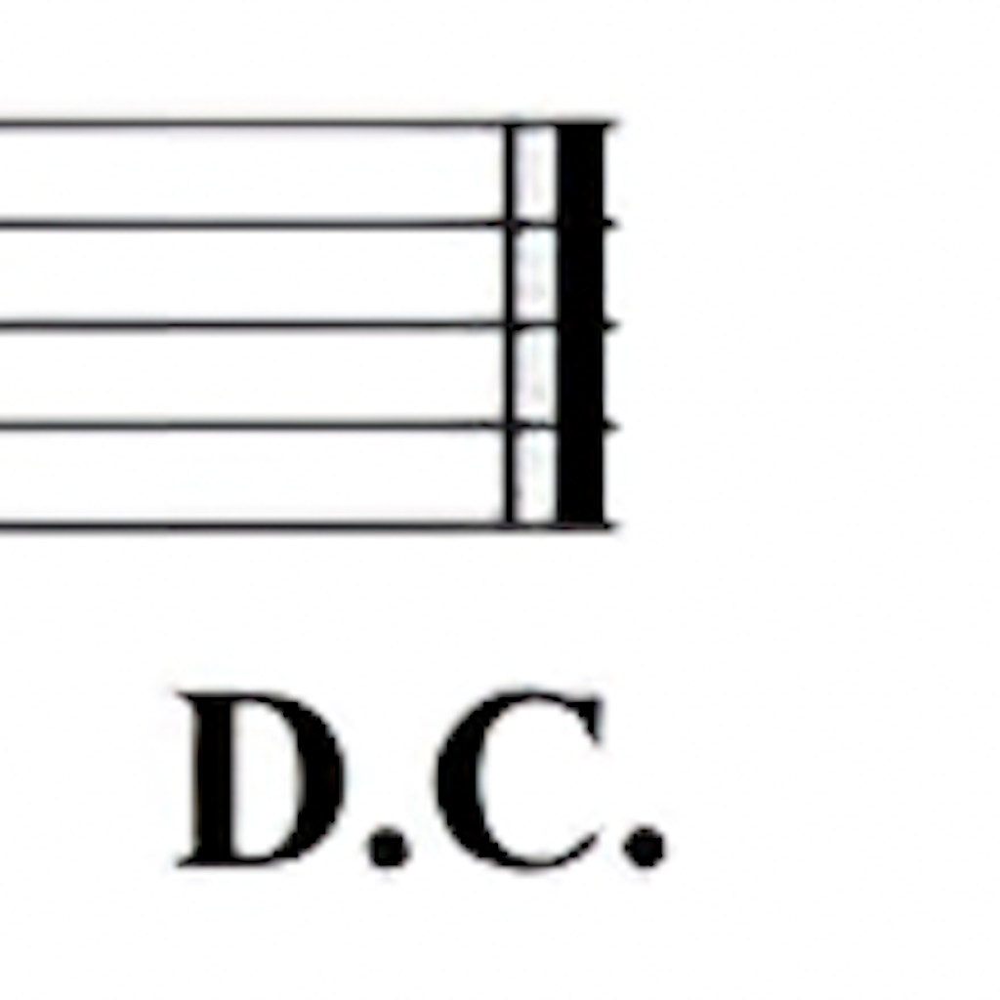
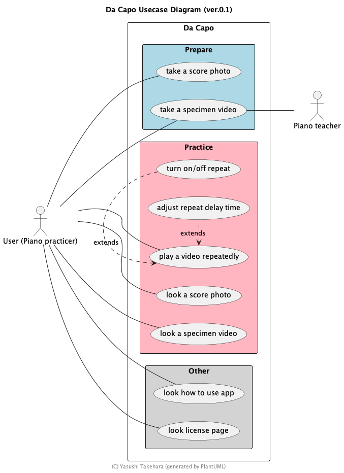
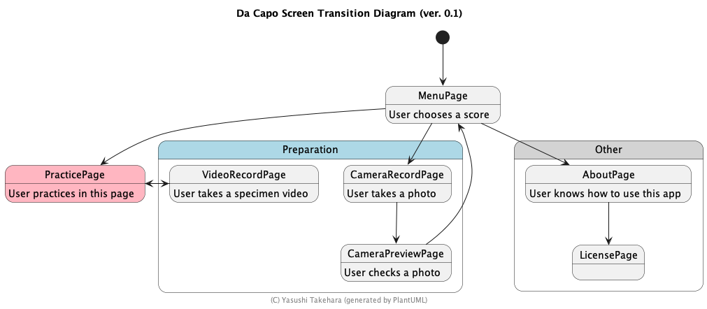
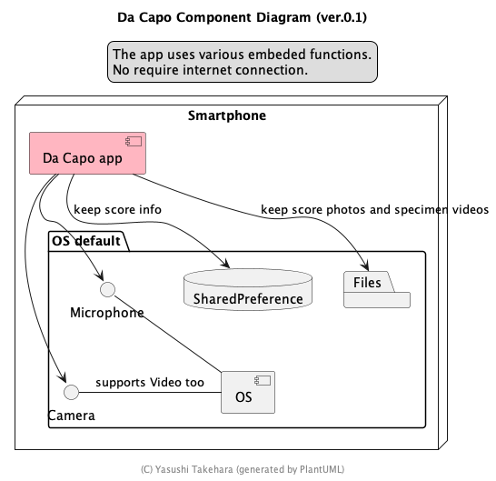
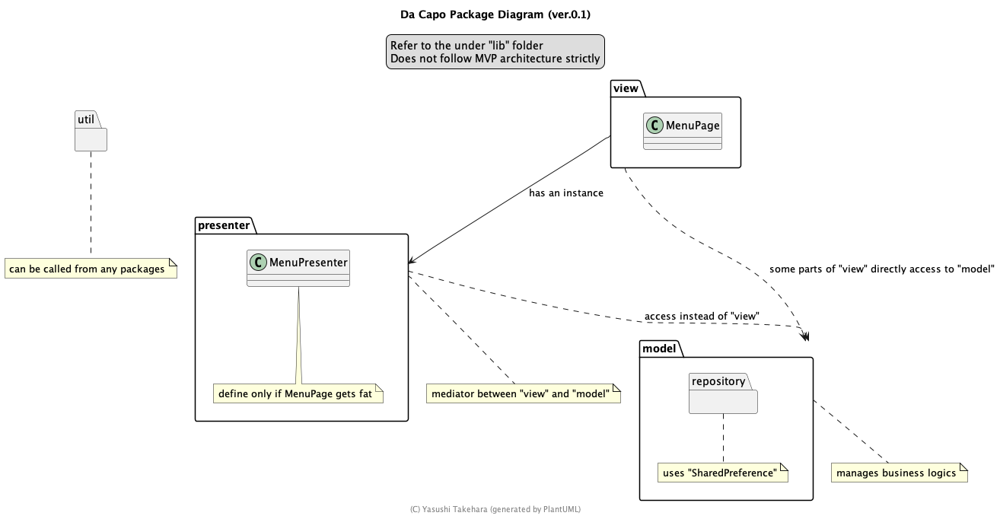

# Da Capo
<div style="text-align: center">

</div>
A new Flutter project for smartphone users to practice piano.


## Introduction Movie

https://user-images.githubusercontent.com/34704994/200155826-ab45831b-7e99-4794-bf1d-a4a1c078f113.mp4

## Getting Started

Recommended dev env

* mac 
* VSCode

## How to Run
execute
```
flutter run
```

## Spec
### Usecase Diagram

### Screen Transition Diagram

### Component Diagram

### Package Diagram

